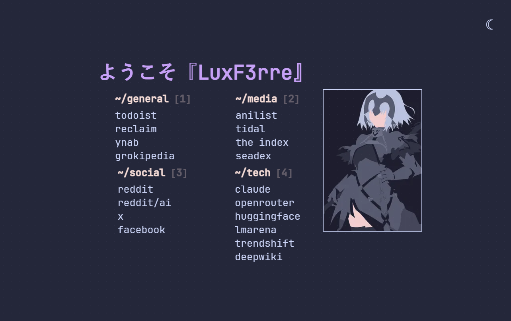

# startpage

A personal browser start page built with [Astro](https://astro.build/), featuring the [Catppuccin](https://github.com/catppuccin/catppuccin) color palette and JetBrains Mono Nerd Font.



## Features

- Categorized quick-access links (general, media, social, tech)
- Catppuccin Macchiato (dark) and Latte (light) themes with system preference detection
- Inline search — press `/` to filter links, with fallback to Brave Search
- Keyboard navigation — Tab/Shift+Tab to cycle links, 1–4 to jump to categories
- CRT-style dot grid overlay for a retro aesthetic
- Fade-in animations with staggered timing
- Theme-aware dynamic SVG favicon
- JetBrains Mono Nerd Font with build-time optimization:
  - Automatic font subsetting — only characters actually used on the page are included
  - WOFF2 compression (reduces the ~2.3 MB TTF source to a few KB)
  - `font-display: swap` for fast initial render with graceful fallback
  - Self-hosted (no external CDN requests)
- Responsive layout
- Optimized images via `sharp`

## Getting Started

### Prerequisites

- [Node.js](https://nodejs.org/) (v18+)
- [pnpm](https://pnpm.io/)

### Install

```bash
pnpm install
```

### Development

```bash
pnpm dev
```

### Build

```bash
pnpm build
```

### Preview

```bash
pnpm preview
```

## Customization

| What | Where |
|------|-------|
| Links & categories | `src/pages/index.astro` — edit the `<ul>` elements |
| Logo | Replace `src/assets/logo.png` |
| Page title | Change the `title` constant at the top of `index.astro` |
| Theme colors | CSS custom properties in the `<style>` block of `index.astro` |
| Search engine | Modify the fallback URL in the search handler script |
| Keyboard shortcuts | Inline `<script>` section of `index.astro` |

## Tech Stack

- [Astro](https://astro.build/)
- [sharp](https://sharp.pixelplumbing.com/) (image optimization)
- [subset-font](https://github.com/nicolo-ribaudo/subset-font) (font subsetting)
# startpage
# startpage
# startpage
